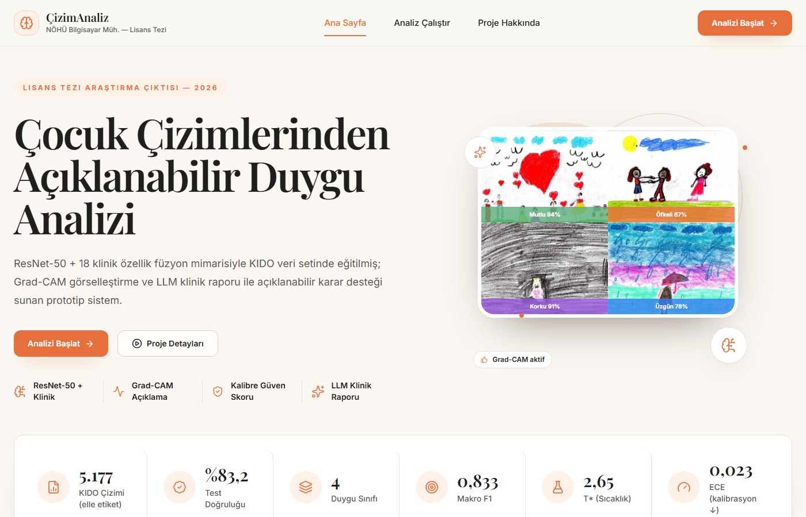
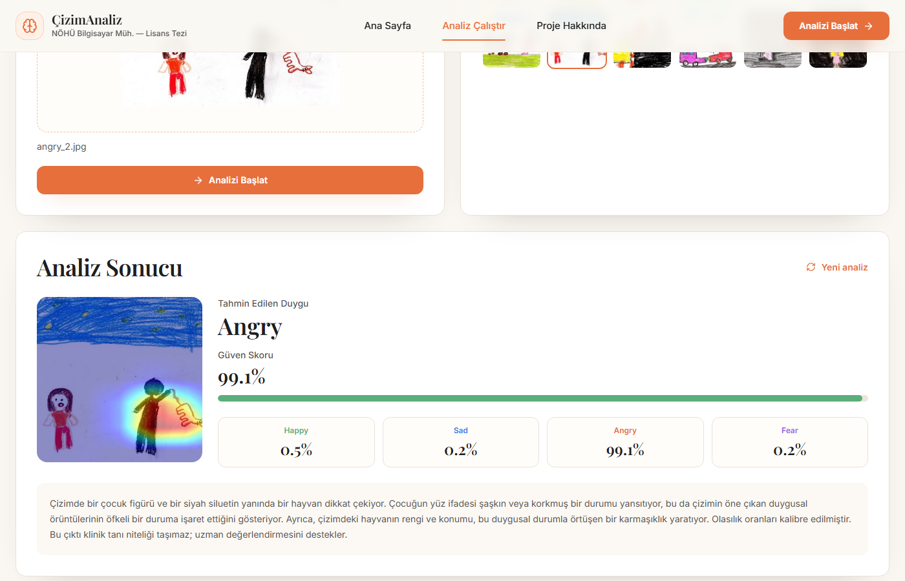
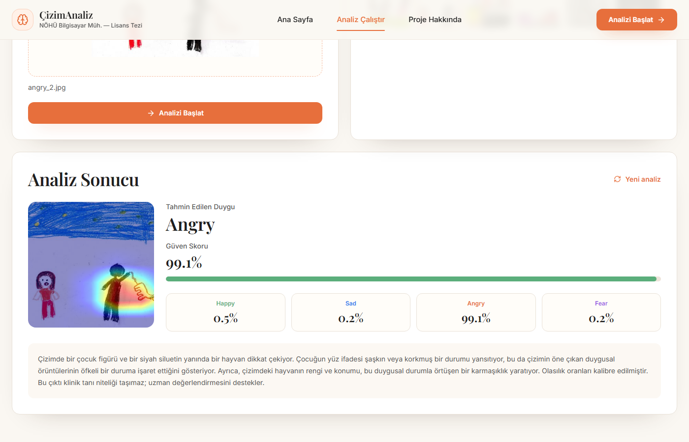
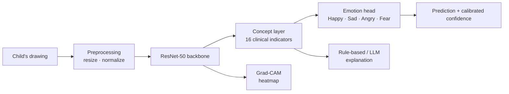

# CCDDA — Explainable Emotion Analysis from Children's Drawings

> **Child Art Analyzer** — an interpretable deep-learning system that classifies the
> dominant emotion in a child's drawing (**Happy · Sad · Angry · Fear**) and explains
> *why*, by first predicting human-readable clinical indicators inspired by projective
> drawing tests (Koppitz, Di Leo).

<p align="center">
  
</p>

This repository is the software product of a **B.Sc. graduation thesis** at the
Department of Computer Engineering, **Niğde Ömer Halisdemir University**. It ships as
both a **web application** (FastAPI + React) and a packaged **Windows desktop app**.

---

## Why it's different: explainability without an accuracy penalty

Most image classifiers go straight from pixels to a label. CCDDA's final model is a
**Concept Bottleneck Model (CBM)**: it first predicts **16 interpretable clinical
indicators** (figure size, line pressure, shading, spatial placement, …) and then
derives the emotion *only* from those concepts. Every prediction is therefore
traceable to clinically grounded features.

The headline finding of the thesis: **moving the bottleneck through interpretable
concepts did not reduce accuracy — it slightly improved it.** There was no
"interpretability tax." See [Results](#results).

---

## Features

- 🎯 **4-class emotion classification** from a single drawing image.
- 🧠 **Concept Bottleneck Model** — predictions flow through 16 interpretable clinical
  indicators, not opaque features.
- 🔍 **Grad-CAM heatmaps** highlighting the regions that drove the prediction.
- 📝 **Natural-language explanations** — an LLM (GitHub Models) turns the predicted
  concepts into a readable narrative, with a deterministic **rule-based fallback** when
  no token is configured.
- 🌐 **Web app** (React + Vite frontend, FastAPI backend) with Turkish/English UI.
- 🖥️ **Desktop app** (PyInstaller + WebView2) packaged as a Windows installer.

<p align="center">
  
  
</p>

---

## Architecture



**Loss** = `CrossEntropy(emotion) + λ · MSE(concepts)`. The backbone is **ResNet-50**;
the model supports a pure `bottleneck` mode (emotion derived only from concepts) and a
`hybrid` mode (concepts + image features). The deployed model uses `bottleneck`.

### The 16 clinical indicators

Grounded in the projective drawing literature (Koppitz 1968, Di Leo 1973), grouped
into five clinical families:

| Group | Indicators |
|-------|-----------|
| **Figure size & placement** | `figure_size_ratio`, `figure_centrality`, `figure_vertical_pos`, `figure_tilt` |
| **Line quality & pressure** | `stroke_darkness_mean`, `line_tremor`, `pressure_variation`, `sharp_angle_ratio` |
| **Shading & integrity** | `shading_on_figure`, `part_fragmentation`, `component_count_norm` |
| **Composition** | `fg_area_ratio`, `empty_space_ratio`, `dark_color_ratio` |
| **Color & composite** | `color_warmth`, `figure_integrity_proxy` |

---

## Results

Evaluated on the held-out test set (KIDO dataset, manually re-labeled with 4 emotion
classes). Metric: **Macro F1**.

| # | Configuration | Test Acc | Macro F1 |
|---|---------------|:--------:|:--------:|
| | EfficientNet-B0 (image only) | 0.791 | 0.783 |
| | EfficientNet-B3 (image only) | 0.795 | 0.798 |
| | ResNet-50 (image only) | 0.826 | 0.826 |
| | ResNet-50 + clinical fusion | 0.818 | 0.821 |
| | **CBM — bottleneck (18 concepts)** | 0.823 | **0.849** ⭐ best |
| | **CBM — bottleneck (16 concepts, deployed)** | 0.821 | **0.834** 🚀 shipped |

**Key takeaways**

- The interpretable **bottleneck CBM beats the standard fusion model** (0.849 vs 0.821)
  — concept supervision acts as a useful inductive bias.
- The **bottleneck variant ≥ the hybrid variant** in every comparison, confirming there
  is **no interpretability tax**.
- Per-class F1 of the deployed model (V2): Happy **0.86**, Sad **0.66**, Angry **0.93**,
  Fear **0.88**. *Sad* remains the hardest class.

---

## Project structure

```
.
├── api_server.py          FastAPI inference server (/predict, /health)
├── desktop_app.py         WebView2 desktop shell + embedded backend
├── desktop_app.spec       PyInstaller build spec
├── src/                   Core ML library
│   ├── data/              Dataset, transforms, manifest building
│   ├── features/          Clinical feature extraction (v1)
│   ├── models/            Backbones, fusion & Concept Bottleneck classifiers
│   ├── train/             Training entry points
│   ├── inference/         Inference pipelines (v1 fusion, v2 CBM) + calibration
│   ├── explain/           Grad-CAM, rule-based & LLM explainers
│   └── eval/              Evaluation utilities
├── clinical_v2/           v2 clinical indicators (16-concept, figure-aware) + CBM training
├── scripts/               Training, evaluation, manifest & poster generation scripts
├── Web/                   React + Vite frontend (TypeScript, Tailwind)
├── installer/             Inno Setup installer definition & assets
├── model/                 Bundled feature statistics (checkpoint is git-ignored)
├── docs/                  Documentation & screenshots
├── requirements.txt       Python dependencies
└── README.md
```

> **Not included in the repository** (kept local via `.gitignore`): the raw `Dataset/`,
> trained checkpoints (`*.pt`, ~96 MB), generated experiment outputs (`out/`), and all
> thesis material (`tez/`).

---

## Getting started

### Prerequisites

- Python 3.10+
- Node.js 18+
- A trained checkpoint at `model/concept_bottleneck.pt` (or point `CCDDA_CHECKPOINT`
  to your own `.pt`). Checkpoints are not committed to the repo.

### 1. Install dependencies

```powershell
# Backend
python -m venv .venv
.\.venv\Scripts\Activate.ps1
pip install -r requirements.txt

# Frontend
cd Web
npm install
cd ..
```

### 2. Configure environment

```powershell
copy .env.example .env
```

| Variable | Purpose | Default |
|----------|---------|---------|
| `CCDDA_CHECKPOINT` | Path to the model `.pt` | bundled `model/concept_bottleneck.pt` |
| `CCDDA_DEVICE` | `cpu` or `cuda` | `cpu` |
| `GITHUB_TOKEN` | GitHub Models token for LLM explanations (optional) | — |

Without `GITHUB_TOKEN`, the app automatically uses the rule-based explainer.

### 3. Run (backend + frontend together)

**Windows (PowerShell):**

```powershell
Start-Process powershell -ArgumentList '-NoExit','-Command','uvicorn api_server:app --host 0.0.0.0 --port 8000 --reload'; Start-Process powershell -ArgumentList '-NoExit','-Command','cd Web; npm run dev'
```

**Linux / macOS (bash):**

```bash
(uvicorn api_server:app --host 0.0.0.0 --port 8000 --reload &) && (cd Web && npm run dev)
```

The frontend opens at `http://localhost:3000` and proxies `/api` requests to the
backend at `127.0.0.1:8000`.

### Desktop build

See [docs/DESKTOP_APP.md](docs/DESKTOP_APP.md) for packaging the Windows desktop app.

---

## API

| Method | Endpoint | Description |
|--------|----------|-------------|
| `GET`  | `/health` · `/api/health` | Model load status, checkpoint, device |
| `POST` | `/predict` · `/api/predict` | Multipart image (`image` or `file`), optional `lang` (`tr`/`en`) → emotion, confidence, concepts, explanation |

---

## Dataset

The model was trained on the **KIDO** dataset, **manually re-labeled** with four
emotion classes (human labels, not pseudo-labels). The raw dataset is not distributed
with this repository.

---

## ⚠️ Disclaimer

This is a **research and educational** project. Its output is **not a clinical
diagnosis** and must not be used as one. Any interpretation of a child's drawing should
be made by a qualified professional. The system is intended to assist and illustrate
explainable-AI techniques, not to replace expert assessment.

---

## Academic context

Developed as a B.Sc. graduation thesis (in Turkish) at Niğde Ömer Halisdemir
University, Department of Computer Engineering. The thesis manuscript, references, and
figures are kept local and are not part of this public repository.
