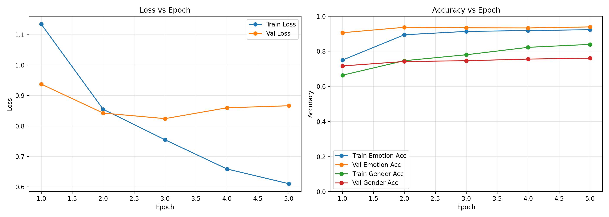
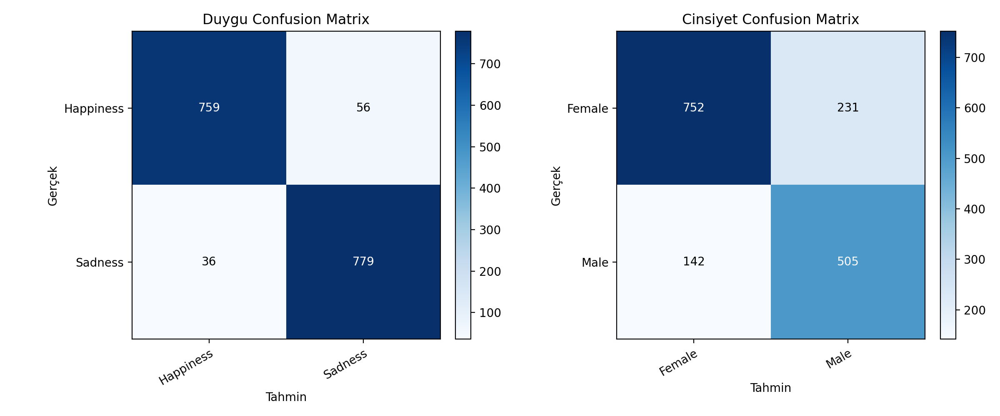
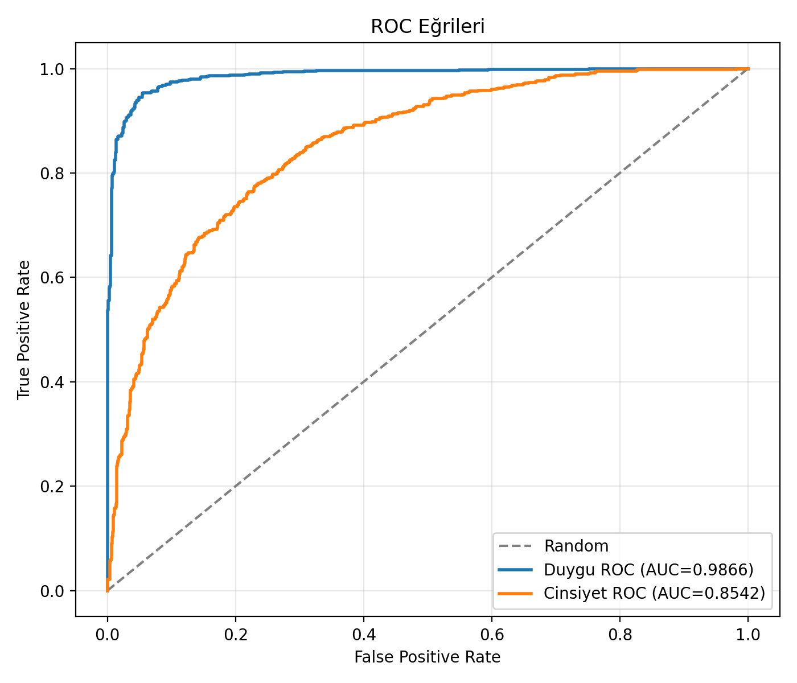
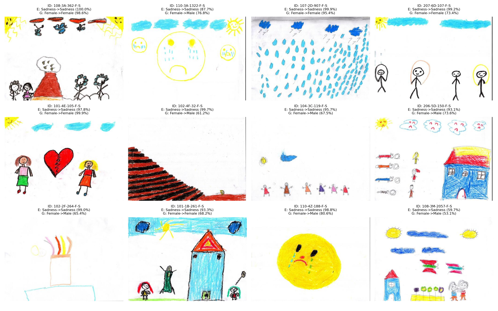

# TÜBİTAK 2209-A Proje Sonuç Raporu

## Proje Bilgileri

- Proje Adı: Çocukların Yaptıkları Çizimlerden Derin Öğrenme Yöntemleri ile Duygu Durumu Analizi
- Proje Yürütücüsü: Alper YALÇIN
- Danışman: Arş. Gör. Alper ECEMİŞ
- Kurum: Niğde Ömer Halisdemir Üniversitesi, Bilgisayar Mühendisliği
- Rapor Türü: Proje Sonuç Raporu

## Özet

Bu projede, çocuk çizimlerinden duygu durumu tespiti yapabilen açıklanabilir bir yapay zeka sistemi geliştirilmiştir. Projenin başlangıç hedefi çizimlerden duygu analizi yapmak olmakla birlikte, veri setinde yer alan metinsel bilgiyi de kullanabilmek amacıyla sistem çok modlu bir mimariye genişletilmiştir. Nihai sistem, çizim görüntüsünü ve varsa çocuğa ait metinsel ifadeyi birlikte işleyerek duygu sınıflandırması yapmakta; buna ek olarak cinsiyet sınıflandırması, paylaşılan temsil öğrenmesini iyileştirmek amacıyla yardımcı bir görev olarak ele alınmaktadır. Böylece modelin ortak temsil öğrenmesi güçlendirilmiş, sistem çıktıları görsel ve metinsel açıklanabilirlik bileşenleri ile desteklenmiştir.

Geliştirilen sistemde görsel özellik çıkarımı için EfficientNet-B0, metin özellik çıkarımı için BERTurk tabanlı bir dil modeli kullanılmıştır. Bu iki özellik uzayı birleştirilerek duygu ve cinsiyet için iki ayrı sınıflandırma başlığı oluşturulmuştur. Ayrıca Grad-CAM ile görsel odak bölgeleri, token tabanlı önem skorları ile de metin açıklamaları üretilmiştir. Eğitim ve test sonuçlarına göre duygu sınıflandırma görevinde test doğruluğu %94,36; makro F1 skoru %94,35; ROC-AUC değeri 0.9866 olarak elde edilmiştir. Yardımcı görev olan cinsiyet sınıflandırmasında ise test doğruluğu %77,12, makro F1 skoru %76,58 ve ROC-AUC değeri 0.8542 olarak ölçülmüştür.

Proje çıktısı olarak yalnızca bir eğitim modeli değil, aynı zamanda yeniden üretilebilir deney altyapısı, açıklanabilirlik modülü, FastAPI tabanlı servis ve React tabanlı bir web arayüzü geliştirilmiştir. Elde edilen sonuçlar, çocuk çizimlerinden duygu analizi alanında yapay zeka destekli karar destek sistemlerinin geliştirilebileceğini göstermektedir. Bununla birlikte sistem klinik tanı aracı değildir; uzman değerlendirmesini desteklemek amacıyla kullanılmalıdır.

## 1. Projenin Amacı ve Kapsamı

Projenin temel amacı, çocukların yaptıkları çizimlerden duygusal durum hakkında otomatik çıkarım yapabilen bir derin öğrenme sistemi geliştirmektir. Bu amaç doğrultusunda aşağıdaki alt hedefler belirlenmiştir:

- Çizim görüntülerini ve eşlenik metinleri içeren işlenebilir bir veri yapısı oluşturmak
- Duygu sınıflandırması yapabilen derin öğrenme tabanlı bir model geliştirmek
- Model kararlarını açıklanabilir hale getirmek
- Sonuçları kullanıcıya sunabilecek bir prototip sistem ortaya koymak

Uygulama sürecinde proje kapsamı, veri setinde yer alan metinsel bilgiyi de kullanabilmek amacıyla çok modlu bir mimariye genişletilmiştir. Buna ek olarak cinsiyet sınıflandırması, paylaşılan temsil öğrenmesini iyileştirmek amacıyla yardımcı bir görev olarak eklenmiştir. Ancak projenin ana değerlendirme ekseni duygu analizi olarak korunmuştur.

## 2. Kullanılan Veri Seti ve Veri Hazırlama Süreci

Projede KIDO veri seti kullanılmıştır. Veri seti içindeki duygu ve cinsiyet etiketleri, ortak örnek kimlikleri üzerinden birleştirilerek tek bir ana tablo haline getirilmiştir. Oluşturulan `master_emotion_gender.csv` dosyası proje boyunca temel veri kaynağı olarak kullanılmıştır.

Kullanılan veri setine aşağıdaki bağlantı üzerinden erişilmiştir:

https://huggingface.co/datasets/serdarciftci/KIDO

Veri hazırlama sürecinde aşağıdaki adımlar gerçekleştirilmiştir:

- Duygu etiketleri için eğitim ve test CSV dosyaları okunmuştur
- Cinsiyet etiketleri için eğitim ve test CSV dosyaları okunmuştur
- Aynı örneğe ait duygu ve cinsiyet bilgileri `id` ve `split` alanları üzerinden birleştirilmiştir
- Her örneğe karşılık gelen çizim dosyası yolu otomatik olarak üretilmiştir
- Türkçe metin öncelikli olacak şekilde metinsel içerik veri yapısına dahil edilmiştir

Deneylerde kullanılan toplam örnek sayısı `10856` olmuştur. Orijinal veri ayrımı `9226` eğitim ve `1630` test örneğinden oluşmaktadır. Eğitim verisi ayrıca deney sırasında `7843` eğitim ve `1383` doğrulama örneğine ayrılmıştır.

Duygu sınıfları:

- Happiness
- Sadness

Yardımcı görev olarak kullanılan cinsiyet sınıfları:

- Female
- Male

## 3. Yöntem

### 3.1 Genel Mimari

Geliştirilen model çok modlu ve çok görevli bir yapıya sahiptir. Modelin ana bileşenleri şunlardır:

- Görsel omurga: EfficientNet-B0
- Metin omurga: `dbmdz/bert-base-turkish-cased`
- Füzyon katmanı: Görsel ve metin gömülerinin birleştirilmesi
- Çıkış başlıkları: Duygu sınıflandırma başlığı ve cinsiyet sınıflandırma başlığı

Bu yapı sayesinde çizim görüntüsünden elde edilen uzaysal örüntüler ile metinsel ifadelerden elde edilen anlamsal ipuçları aynı anda değerlendirilebilmiştir.

### 3.2 Ön İşleme

Görseller için aşağıdaki dönüşümler uygulanmıştır:

- Yeniden boyutlandırma: `224x224`
- Rastgele yatay çevirme
- Rastgele döndürme
- Normalize etme

Metin tarafında ise BERT tokenizer kullanılarak:

- Maksimum dizi uzunluğu `128`
- Türkçe metin öncelikli kullanım
- Boş metin durumunda İngilizce metne geri dönüş

yaklaşımı izlenmiştir.

### 3.3 Eğitim Süreci

Eğitim sürecinde aşağıdaki ayarlar kullanılmıştır:

- Epoch sayısı: `5`
- Batch size: `16`
- Öğrenme oranı: `0.0001`
- Optimizer: `AdamW`
- Weight decay: `0.0001`
- Doğrulama oranı: `0.15`
- Seed: `42`

Epoch sayısı `5` olarak belirlenmiştir. Eğitim eğrileri incelendiğinde modelin ilk birkaç epoch içinde hızlı biçimde yakınsadığı ve erken yakınsama davranışı gösterdiği gözlenmiştir. Modelin duygu ve cinsiyet görevleri için toplam kaybı ağırlıklı biçimde hesaplanmıştır. Cinsiyet görevi yardımcı bir görev olarak modelde tutulmuş, fakat duygu görevi proje amacının ana ekseni olarak değerlendirilmiştir.

### 3.4 Açıklanabilirlik Bileşenleri

Projede model kararlarının yorumlanabilir olması amacıyla iki farklı açıklanabilirlik yaklaşımı kullanılmıştır:

- Grad-CAM: Görsel üzerinde modelin odaklandığı bölgelerin ısı haritası olarak gösterilmesi
- Token önem analizi: Metin girdisindeki kelime veya alt kelimelerin karar üzerindeki etkisinin puanlanması

Bu yapı, model çıktılarının yalnızca sınıf etiketi olarak değil, kararın hangi bölgelere ve hangi ifadelere dayandığını da gösteren bir karar destek mekanizmasına dönüşmesini sağlamıştır.

## 4. Gerçekleştirilen Çalışmalar

Proje süresince aşağıdaki teknik çalışmalar tamamlanmıştır:

- Veri seti birleştirme ve ana CSV üretim modülü geliştirilmiştir
- Çok modlu veri kümesi sınıfı oluşturulmuştur
- EfficientNet-B0 ve BERTurk temelli çok görevli model geliştirilmiştir
- Eğitim ve doğrulama döngüleri oluşturulmuştur
- Deneylerin tekrar üretilebilirliği için raporlayıcı çalıştırma aracı hazırlanmıştır
- Grad-CAM ve metin açıklama modülleri eklenmiştir
- Tek örnek tahmini ve açıklama üretimi yapan komut satırı aracı geliştirilmiştir
- Tkinter tabanlı masaüstü prototip hazırlanmıştır
- FastAPI tabanlı servis katmanı geliştirilmiştir
- React tabanlı web arayüzü hazırlanmıştır

Bu sayede proje yalnızca akademik bir model deneyi olarak kalmamış, kullanıcı etkileşimine açık bir prototip sisteme dönüştürülmüştür.

## 5. Elde Edilen Bulgular ve Deney Sonuçları

Deneyler `artifacts/report_run` altında kayıt altına alınmıştır. Test kümesinde elde edilen temel sonuçlar aşağıda sunulmuştur.

### 5.1 Duygu Sınıflandırma Sonuçları

| Metrik | Değer |
|---|---:|
| Accuracy | 0.9436 |
| Precision (macro) | 0.9438 |
| Recall (macro) | 0.9436 |
| F1 (macro) | 0.9435 |
| ROC-AUC | 0.9866 |

Duygu sınıfı bazında sonuçlar:

| Sınıf | Precision | Recall | F1 | Support |
|---|---:|---:|---:|---:|
| Happiness | 0.9547 | 0.9313 | 0.9429 | 815 |
| Sadness | 0.9329 | 0.9558 | 0.9442 | 815 |

Confusion matrix incelendiğinde modelin her iki duygu sınıfını da dengeli biçimde ayırt edebildiği görülmektedir. Happiness sınıfına ait `815` örneğin `759` tanesi doğru sınıflandırılırken `56` örnek Sadness olarak etiketlenmiştir. Benzer biçimde, Sadness sınıfına ait `815` örneğin `779` tanesi doğru sınıflandırılmış, `36` örnek ise Happiness sınıfına atanmıştır. Bu dağılım, modelin sınıflar arasında yüksek ayrım gücü sergilediğini ve hata örüntüsünün belirgin bir tek yönlü yanlılık üretmediğini göstermektedir.

Bu sonuçlar, proje önerisinde hedeflenen `%85` doğruluk eşiğinin üzerine çıkıldığını göstermektedir.

### 5.2 Yardımcı Görev Olarak Cinsiyet Sınıflandırma Sonuçları

| Metrik | Değer |
|---|---:|
| Accuracy | 0.7712 |
| Precision (macro) | 0.7637 |
| Recall (macro) | 0.7728 |
| F1 (macro) | 0.7658 |
| ROC-AUC | 0.8542 |

Sınıf bazında sonuçlar:

| Sınıf | Precision | Recall | F1 | Support |
|---|---:|---:|---:|---:|
| Female | 0.8412 | 0.7650 | 0.8013 | 983 |
| Male | 0.6861 | 0.7805 | 0.7303 | 647 |

Bu görev, sistemde ana amaç değil, paylaşılan temsil öğrenmesini iyileştirmek amacıyla kullanılan yardımcı bir görevdir. Buna rağmen kabul edilebilir düzeyde bir performans üretmiştir.

### Şekil 1 – Eğitim Eğrileri

Model eğitim sürecinde eğitim ve doğrulama kayıp ve doğruluk değerlerinin epoch bazında değişimi.

### Şekil 2 – Confusion Matrix

Duygu sınıflandırma görevinde model tahminlerinin sınıf bazında dağılımını gösteren confusion matrix.

### Şekil 3 – ROC Eğrisi

Modelin duygu sınıflandırma görevinde ROC eğrisi ve AUC değeri.

### Şekil 4 – Örnek Tahminler

Test veri setinden örnek çizimler ve model tarafından üretilen tahminler.

## Deneylerin Tekrar Üretilebilirliği

Bu projede gerçekleştirilen deneyler tekrar üretilebilir biçimde kurgulanmıştır. Eğitim, değerlendirme ve raporlama sürecini otomatikleştiren betikler kullanılmış; özellikle `tools/run_report.py` betiği ile deney çıktılarının standart biçimde üretilmesi sağlanmıştır. Deneylere ait tüm çıktılar `artifacts/report_run` dizini altında kaydedilmektedir. Metrik dosyaları, değerlendirme tabloları ve görseller otomatik olarak oluşturulmakta ve aynı klasör yapısı altında saklanmaktadır. Bu yaklaşım, deneylerin aynı parametrelerle yeniden çalıştırılmasını ve sonuçların tutarlı biçimde doğrulanmasını kolaylaştırmaktadır.

## 6. Ortaya Konan Sistem

Proje sonunda aşağıdaki bileşenlerden oluşan bütünleşik bir sistem geliştirilmiştir:

### 6.1 Model Katmanı

- Eğitilmiş çok modlu model
- En iyi model ağırlıkları
- Yeniden eğitim yapılmasını sağlayan eğitim betikleri

### 6.2 Açıklanabilirlik Katmanı

- Duygu için Grad-CAM görselleri
- Cinsiyet için Grad-CAM görselleri
- Metin girdisi mevcut olduğunda token önem skorları

### 6.3 Servis Katmanı

- FastAPI tabanlı `/api/predict` servisi
- Görsel yükleme ile tahmin üretimi
- Güven skoru, açıklama ve ısı haritası döndürme

### 6.4 Arayüz Katmanı

- React tabanlı web arayüzü
- Görsel yükleme ve sonuç görüntüleme akışı
- Isı haritası ve açıklama metni gösterimi
- Masaüstü kullanım için Tkinter tabanlı prototip

Bu yapı proje çıktısının yalnızca araştırma seviyesinde kalmadığını, prototip sistem düzeyine ulaştığını göstermektedir.

## 7. Proje Hedefleri ile Sonuçların Karşılaştırılması

Proje başlangıcında belirlenen hedeflerle elde edilen sonuçlar karşılaştırıldığında aşağıdaki değerlendirme yapılmıştır:

- Çizim verilerinden duygu analizi yapabilen bir model geliştirme hedefi gerçekleştirilmiştir
- Açıklanabilirlik bileşeni eklenmesi hedefi gerçekleştirilmiştir
- Sonuçların uzmanlara sunulabileceği bir prototip arayüz geliştirme hedefi gerçekleştirilmiştir
- Başarı için öngörülen `%85` doğruluk eşiği duygu görevinde aşılmıştır

Ancak uygulama sürecinde bazı yapısal farklılaşmalar oluşmuştur:

- Nihai sistem yalnızca çizim değil, metin girdisini de kullanabilen çok modlu bir yapıya dönüşmüştür
- Duygu görevine ek olarak yardımcı bir cinsiyet sınıflandırma başlığı eklenmiştir
- Mevcut kodda en iyi model seçimi duygu metriği yerine cinsiyet doğrulama başarısına göre yapılmaktadır

Bu durum proje hedefini tamamen bozmasa da, gelecekte duygu görevi merkezli bir değerlendirme için model seçim kriterinin doğrudan duygu başarısına göre güncellenmesi önerilmektedir.

## 8. Karşılaşılan Sorunlar ve Çözüm Yaklaşımları

Proje sürecinde aşağıdaki temel sorunlarla karşılaşılmıştır:

### 8.1 Veri Yapısının Çoklu Etiket İçermesi

KIDO veri setinde duygu ve cinsiyet etiketleri ayrı dosyalarda tutulduğu için örneklerin doğru şekilde birleştirilmesi gerekmiştir. Bu sorun, kimlik ve veri bölmesi bilgisi üzerinden merge işlemi yapılarak çözülmüştür.

### 8.2 Çok Modlu Yapının Eğitim Maliyeti

Görsel ve metin omurgalarının birlikte kullanılması eğitim maliyetini artırmıştır. Bu nedenle BERT omurgası dondurularak eğitilebilir parametre sayısı düşürülmüş ve eğitim daha yönetilebilir hale getirilmiştir.

### 8.3 Açıklanabilirlik ve Kullanıcı Sunumu

Modelin yalnızca sınıf etiketi üretmesi yeterli görülmemiştir. Kararların kullanıcıya açıklanabilir biçimde sunulabilmesi için Grad-CAM ve token önem analizleri sisteme eklenmiştir.

### 8.4 Etik ve Yorumlama Riski

Çocuk çizimlerinden elde edilen tahminlerin klinik tanı gibi yorumlanması riskli olduğundan, sistem karar destek aracı olarak sınırlandırılmış ve raporda bu sınırlılık açık biçimde belirtilmiştir.

## 9. Projenin Katkısı ve Yaygın Etkisi

Bu projenin temel katkıları aşağıda özetlenmiştir:

- Çocuk çizimlerinden duygu analizi için açıklanabilir yapay zeka yaklaşımı ortaya konmuştur
- Görsel ve metinsel verileri birleştiren çok modlu bir mimari geliştirilmiştir
- Akademik raporlama için tekrar üretilebilir deney altyapısı kurulmuştur
- Karar destek amaçlı kullanılabilecek bir prototip servis ve arayüz hazırlanmıştır

Proje; eğitim, çocuk gelişimi, psikolojik danışmanlık ve insan merkezli yapay zeka alanları arasında köprü kuran disiplinler arası bir çalışma niteliğindedir. Geliştirilen prototip, gelecekte çocuk psikolojisi uzmanlarına yardımcı araçlar geliştirilmesi için bir başlangıç noktası sağlayabilir.

## 10. Sınırlılıklar

Projenin temel sınırlılıkları şunlardır:

- Veri seti yalnızca iki duygu sınıfı ile sınırlandırılmıştır
- Model değerlendirmesi tek veri seti üzerinde yapılmıştır
- Arayüz katmanında bazı senaryolarda sistem metin girdisi olmadan da çalışmaktadır
- Yardımcı cinsiyet görevi, proje teması açısından tartışmalı ve etik açıdan dikkatle ele alınması gereken bir bileşendir
- Sistem klinik tanı amacıyla kullanılmamalıdır

## 11. Sonuç ve Gelecek Çalışmalar

Bu proje sonucunda, çocuk çizimlerinden duygu durumu çıkarımı yapabilen, açıklanabilir ve kullanıcıya sunulabilir bir yapay zeka sistemi geliştirilmiştir. Duygu sınıflandırma görevinde elde edilen `%94,36` doğruluk oranı, sistemin araştırma düzeyinde güçlü bir performans ürettiğini göstermiştir. Ayrıca görsel açıklama haritaları ve metin önem skorları sayesinde modelin karar süreçleri daha anlaşılır hale getirilmiştir.

Gelecek çalışmalarda aşağıdaki iyileştirmeler önerilmektedir:

- Duygu görevinde sınıf sayısının artırılması
- Yardımcı görevlerin etik ve bilimsel açıdan yeniden değerlendirilmesi
- En iyi model seçim kriterinin doğrudan duygu metriğine göre belirlenmesi
- Farklı veri setleri ile dış doğrulama yapılması
- Uzman geri bildirimi içeren insan-merkezli değerlendirme çalışmaları yürütülmesi
- Web arayüzünün saha kullanımına uygun biçimde olgunlaştırılması

Sonuç olarak proje, çocuk çizimlerinden duygu analizi alanında derin öğrenme temelli, açıklanabilir ve prototip düzeyde kullanılabilir bir sistem ortaya koymuştur. Bu çalışma, hem akademik hem de uygulamalı açıdan geliştirilmeye açık güçlü bir temel sunmaktadır.

## 12. Kaynakça

- Goodfellow, I. (2016). Deep Learning. MIT Press.
- LeCun, Y., & Bengio, Y. (2015). Convolutional Networks for Images, Speech, and Time Series. Springer.
- Malchiodi, C. A. (2012). Understanding Children's Drawings. Guilford Press.
